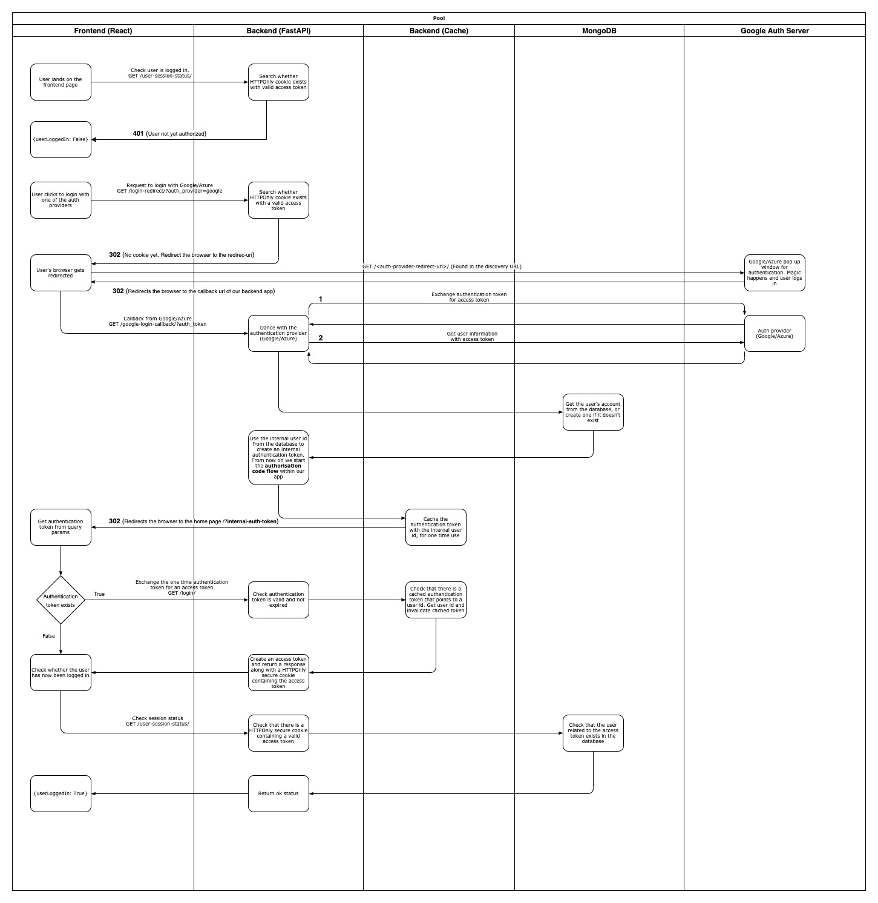

# React + FastApi + Mongo - Login with Google and Azure (OIDC authorization code flow)

As the title describes, these are two separate applications (frontend: react, backend: FastApi) that together perform authentication via Google and Azure using the authorization code flow.

There are probably a tone of options to make this work, but this is the one I came up with after reading a number or articles and also this [bible](https://github.com/tiangolo/fastapi/issues/12)..

## Architecture

Things are fairly simple:
* The frontend is written in react (it's a regular reactjs app created using create-react-app)
* The backend is written using the [FastApi](https://fastapi.tiangolo.com/) framework
* There is also a single mongodb for persistence

Of course, it goes without saying that this is not production ready since there are a gazillion other things that you should consider, but it should be enough to make you understand the OIDC authorization code flow in combination with FastApi's authorization code flow.

## The login flow

I would like to split this login "dance" in two separate phases, in order to make it easier to explain:
1. User authenticates with the "external" Auth provider (Google/Azure)
2. User authenticates with the "internal" Auth provider (Our backend FastApi application)

Of course from a user's point of view, these two phases are indistinguishable.

### User authenticates with the external Auth provider (Google/Azure)
This phase describes the steps up until the user is authenticated by Google/Azure, but not yet with our FastApi application.
* The user lands on our Frontend page
* The user selects to login with one of our external Auth providers (Google/Azure)
* Our FastApi application redirects the user's browser to the external Auth provider's pop-up login window
* The user enters his credentials and authenticates
* The external Auth provider's pop-up redirects the user's browser back to our FastApi application (callback-url) and passes an auth-token as a query parameter
* The FastApi callback handler takes the auth-token and speaks directly to the external Auth provider in order to exchange it for an access-token
* The FastApi application receives an access-token and uses it to speak to external Auth provider again in order to retrieve the user's information
* The FastApi application receives the user's information and creates a new account in the database

The is basically a normal OIDC authorization code flow. However, our user is still not logged in into our system.

### User authenticates with the internal Auth provider (Our backend FastApi application)
This phase describes the steps up until the user is authenticated with our FastApi application.

Remember, our user is still not logged in into our system. Now we are going to perform a second OIDC authorization code flow "dance", but this time the Auth provider will be our FastApi application instead of Google or Azure.

* The FastApi application generates a one time auth-token using the ID of the user that it just created in the database
* The FastApi application redirects the user's browser to the home page and passes the auth-token as a query parameter
* The Frontend application retrieves the auth-token from the query params and speaks back to the FastApi application in order to exchange it for an access-token
* The FastApi application receives the auth-token, checks whether it is valid and not expired, and if everything is find, it generates a HTTPOnly secure cookie that contains an access-token.
* The FastApi application redirects the user's browser once more and attaches the HTTPOnly cookie
* The Frontend application now has an HTTPOnly cookie that is passed down in every request made from the frontend to the backend.

So the user is now authenticated with our FastApi application and every time it visits our pages he/she doesn't need to authenticate with Google/Azure anymore.

Only when the access-token is expired (and you better make these cookies have a short life), he/she will have to login via Google/Azure again.

See the diagram bellow for more details.



## Usage

That was enough talking, how can you use it.

Well this is probably going to be used for quite some debugging and playing around, thus I didn't bother containerizing anything apart from mongo. You can do that yourselves..

1. Install pipenv if you don't have it already
	```
	pip install pipenv
	```

2. Create mongo
	```
	make mongodb
	```

3. Wait until mongo is up and run the FastApi app
	```
	cs python/apps/backend
	pipenv install
	pipenv run uvicorn backend.main:app --host 0.0.0.0
	```

4. Open another terminal and run the react app
	```
	cd react/apps/frontend
	npm start
	```

Your browser should automatically pop up at localhost:3000 and you should be able to see an awesome page.... with just two buttons..

## Don't forget the extra steps

Now, keep in mind that in order to actually get the authentication to work, you will need to have a developer account both with Google and Azure.

I won't explain this here since there are plenty of tutorials showing how to do it, but essentially, you will end up with the following account information.

```
# Google login
GOOGLE_CLIENT_ID= <get this from your google dev account>
GOOGLE_CLIENT_SECRET= <get this from your google dev account>

# Azure login
AZURE_CLIENT_ID= <get this from your azure dev account>
AZURE_CLIENT_SECRET= <get this from your azure dev account>
AZURE_TENANT_ID= <get this from your azure dev account>

# JWT access token configuration
JWT_SECRET_KEY= <generate this using "openssl rand -hex 32">
```

Shove the above into  python/apps/backend/**.env** and you should be ready to go!

## Caution!

I am not a security engineer and not an OAuth/OIDC expert. I merely try to follow as much as possible the instructions I read online and test the code with the knowledge that I have.

Always be aware and make sure you double and triple check the code if it is not yours.

If you figure out that something is not right, please do let me know so that we can both benefit out of it.

## Acknowledgements
Special thanks to **Sebastian Ramirez** for his awesome work in the [FastApi](https://fastapi.tiangolo.com/) project and to all those who contributed to this [thread](https://github.com/tiangolo/fastapi/issues/12). And maybe a few more threads that I might have missed...

## Authors
Chris Liontos
